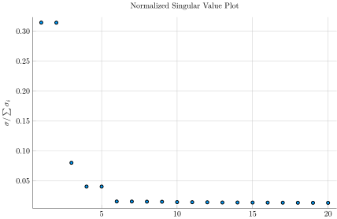

# SingularSpectrumAnalysis
[](https://travis-ci.org/baggepinnen/SingularSpectrumAnalysis.jl)

A package for performing Singular Spectrum Analysis (SSA) https://en.wikipedia.org/wiki/Singular_spectrum_analysis

## Simple Usage
The example below creates a simulated signal that has two strong seasonal components. The main entry function is `analyze(y,L)` that returns the trend and seasonal components
```julia
using SingularSpectrumAnalysis, Plots
# generate some data
L = 20 # Window length
K = 100
N = K*L; # number of datapoints
t = 1:N; # Time vector
T = 20; # period of main oscillation
y = sin.(2pi/T*t); # Signal
y .+= (0.5sin.(2pi/T*4*t)).^2 # Add another frequency
e = 0.1randn(N); # Add some noise
yn = y+e;
# plot(ys)

yt, ys = analyze(yn, L) # trend and seasonal components
plot(yt, lab="Trend")
plot!(ys, lab="Season")
```
## Advanced usage
Internally a Hankel matrix is formed and the SVD of this is calculated. The singular values of the SVD can be plotted to manually determine which singular value belongs to the trend, and which pairs belong to seasonal components (these are always pairs).
```julia
USV = hsvd(yn,L) # Perform svd on the trajectory matrix
plot(USV, cumulative=false) # Plot normalized singular values
```


```julia
seasonal_groupings = [1:2, 4:5] # Determine pairs of singular values corresponding to seasonal components
trend = 3 # If some singular value lacks a buddy, this is a trend component
# trend, seasonal_groupings = autogroup(USV) # This uses a heuristic
pairplot(USV,seasonal_groupings) # plot phase plots for all seasonal components
yrt, yrs = reconstruct(USV, trend, seasonal_groupings) # Reconstruct the underlying signal without noise, based on all identified components with significant singular values
yr = sum([yrt yrs],2) # Form full reconstruction
plot([y ys yr], lab=["y" "ys" "yr"])
```

## Advanced low-level usage
See the implementation of functions `hsvd` and `reconstruct`

## Reading
See http://www.jds-online.com/files/JDS-396.pdf for an easy-to-read introduction to SSA
