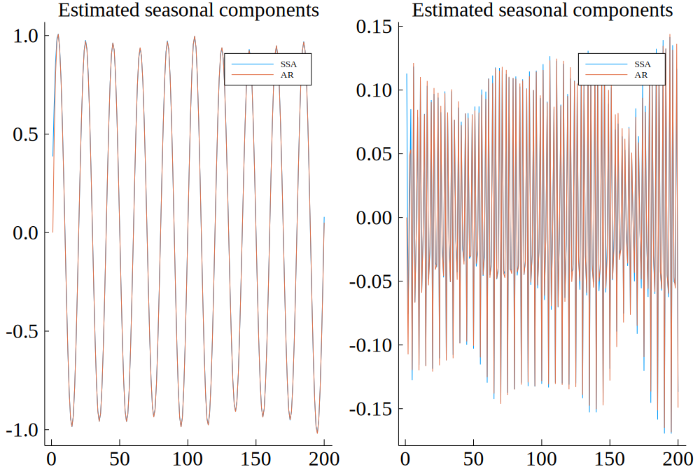
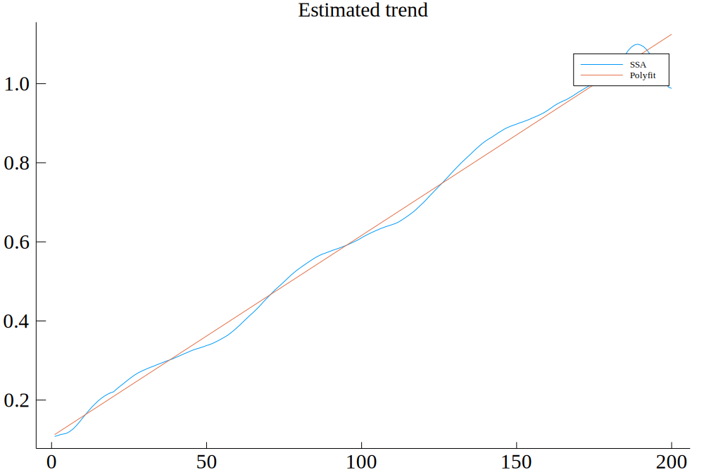
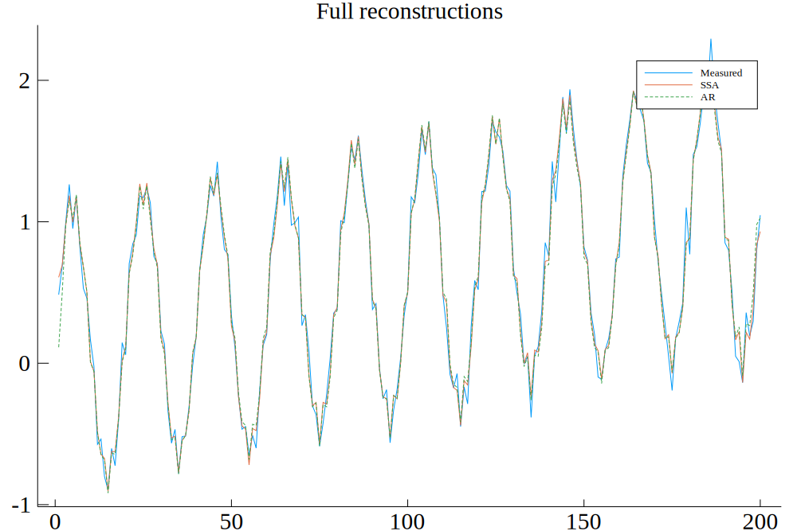

# SingularSpectrumAnalysis
[](https://travis-ci.org/baggepinnen/SingularSpectrumAnalysis.jl)
[](https://codecov.io/gh/baggepinnen/SingularSpectrumAnalysis.jl)

A package for performing Singular Spectrum Analysis (SSA) https://en.wikipedia.org/wiki/Singular_spectrum_analysis

## Simple Usage
The example below creates a simulated signal that has two strong seasonal components. The main entry function is `analyze(y,L)` that returns the trend and seasonal components. `y` is the signal to decompose and `L` is a window length to use for the internal embedding (this should be as long as the longest expected period).
```julia
using SingularSpectrumAnalysis, Plots
# generate some data
L = 20 # Window length
K = 100
N = K*L; # number of datapoints
t = 1:N; # Time vector
T = 20; # period of main oscillation
y = sin.(2pi/T*t); # Signal
y .+= (0.5sin.(2pi/T*4*t)).^2 # Add another frequency
e = 0.1randn(N); # Add some noise
yn = y+e;
# plot(ys)

yt, ys = analyze(yn, L) # trend and seasonal components
plot(yt, lab="Trend")
plot!(ys, lab="Season")
```
## Advanced usage
Internally a Hankel matrix is formed and the SVD of this is calculated. The singular values of the SVD can be plotted to manually determine which singular value belongs to the trend, and which pairs belong to seasonal components (these are always pairs).
```julia
USV = hsvd(yn,L) # Perform svd on the trajectory matrix
plot(USV, cumulative=false) # Plot normalized singular values
```


```julia
seasonal_groupings = [1:2, 4:5] # Determine pairs of singular values corresponding to seasonal components
trend = 3 # If some singular value lacks a buddy, this is a trend component
# trend, seasonal_groupings = autogroup(USV) # This uses a heuristic
pairplot(USV,seasonal_groupings) # plot phase plots for all seasonal components
yrt, yrs = reconstruct(USV, trend, seasonal_groupings) # Reconstruct the underlying signal without noise, based on all identified components with significant singular values
yr = sum([yrt yrs],2) # Form full reconstruction
plot([y ys yr], lab=["y" "ys" "yr"])
```

## Forecasting
We provide the function `fit_trend(yt, order)` to fit an n:th order polynomial to the trend:
```julia
yt, ys = analyze(yn, L)
A,x = fit_trend(yt, 1)
```
This returns the regressor matrix `A` and the polynomial coefficients `x`. This fit can be used to forecast the trend. To forecast the seasonal components, we make use of the package [ControlSystemIdentification.jl](https://github.com/baggepinnen/ControlSystemIdentification.jl) to fit AR(na) models. We create a simulated signal to test with:
```julia
using ControlSystemIdentification, ControlSystems, DSP, Random
Random.seed!(0)
L = 20
K = 10
N = K*L;
t = 1:N;
T = 20;
y = sin.(2pi/T*t);            # Add seasons
y .+= (0.5sin.(2pi/T*4*t)).^2 # Add seasons
y .+= LinRange(0,1,N)         # Add trend
e = 0.1randn(N);
yn = y+e;                     # Add noise
```
Next, we use SSA to find the trend and the seasonal components
```julia
yt, ys = analyze(yn, L) # trend and seasons
A,x = fit_trend(yt, 1)  # Fits a polynomial of order 1 (line)
```
We are now ready to estimate AR models
```julia
na = 2 # Autoregressive order
# Next line fits one AR model for each seasonal component
ns = size(ys,2) # number of seasonal components
models = [ar(1, ys[:,i], na)[1] for i = 1:ns] # Fit one model per component
```
To be able to use the estimated models for prediction, we create predictor filters
```julia
models = ss.(models) # Convert models to state-space form
observers = kalman.(models, Ref(I), Ref(ones(1,1))) # Create observers (Kalman filters)
predictors = [ss(m.A-K*m.C, K, m.C, 0,1) for (m,K) in zip(models, observers)] # Create predictor filters
seasonal_predictions = [simulate(predictors[i], ys[:,i])  for i = 1:ns]
```
Next, we visualize the trends and seasonal components estimated by both SSA and AR models.
```julia
plot(ys, layout=size(ys,2), lab="SSA", title="Estimated seasonal components")
plot!(seasonal_predictions, lab="AR")
```

```julia
plot(yt, lab="SSA", title="Estimated trend")
plot!(A*x, lab="Polyfit")
```

```julia
yr = yt+sum(ys, dims=2)
plot(yn, lab="Measured", title="Full reconstructions")
plot!(yr, lab="SSA")
plot!(+(A*x, seasonal_predictions...), subplot=1, lab="AR", l=(:dash,))
```

## Advanced low-level usage
See the implementation of functions `hsvd` and `reconstruct`

## Reading
See http://www.jds-online.com/files/JDS-396.pdf for an easy-to-read introduction to SSA
